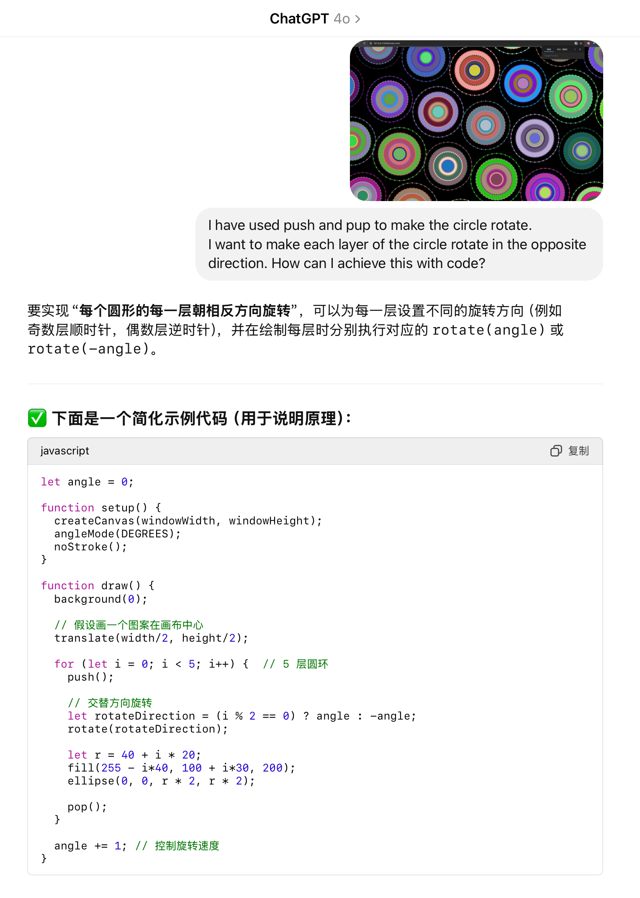

# Perlin Noise-Based Animated Circles

## How to Interact with the Work

This visual piece combines automatic animation, audio-driven effects, and user input:

- After the page loads, the animation will begin automatically.
- **Clicking anywhere** on the canvas will generate ripple-like effects, as seen in Regina's user input section.
- The circles in the center **pulse in sync with background music**, implemented by Danni’s audio-driven animation.

This interaction creates a layered, immersive experience that responds to both movement and sound.

---

## My Animation Approach: Perlin Noise

For my individual contribution, I used **Perlin noise** to drive the animation of each circle’s visual properties. Specifically, I animated:

- **Position**: Each circle gently drifts based on noise-generated offsets.
- **Radius (size)**: Circles pulse over time to simulate breathing-like motion.
- **Color**: The layer and center colors gradually shift between two palettes, driven by time-dependent noise.
- **Rotation**: Concentric layers rotate in opposite directions to create a dynamic, hypnotic effect.

These noise-based animations were implemented inside an IIFE (Immediately Invoked Function Expression) that overrides and extends the `generateCircles()` and `draw()` functions in the group code.

---

## Visual & Conceptual Inspiration

### Rotational Motion

The idea for rotating layers was inspired by the interactive app version of **Vincent Van Gogh’s _Starry Night_**, where celestial forms swirl in opposing directions to create a dreamlike visual field:

> [ Starry Night Interactive App](https://www.youtube.com/watch?v=Ph1SEFWcL58)

This inspired me to add clockwise and counter-clockwise spin effects to each circle layer, depending on the layer index.

### Size Animation

I was also influenced by a sketch (https://openprocessing.org/sketch/2434943), which demonstrated how circle radius can vary over time. This directly informed the `pulseAmp` and `scale` logic in my update function.

---

## Technical Explanation

The animation logic was added by **extending the existing `circleSystem.generateCircles()` and `window.draw()` functions**。 The approach is modular, and all additions are scoped within a self-invoking function.

### Key Logic Components:

#### SECTION 1 – Floating Motion & Radius Pulsing

- Each circle is assigned unique Perlin noise seeds (`seedPos`, `seedRad`).
- Their position and radius are updated in each frame using `noise(seed, t)`.

#### SECTION 2 – Color Interpolation

- The circle’s colors smoothly transition between a base palette and a randomly chosen target palette.
- Interpolation uses lerpColor combined with noise-driven blending factors.

#### SECTION 3 – Layer-Wise Rotation

- Each circle is assigned a base rotation angle (baseRot) and a rotation speed per layer.
Even-numbered layers rotate clockwise, odd layers rotate counter-clockwise.
- This logic was developed with assistance from ChatGPT and manually integrated.

### Modifications to Group Code

- Color Randomization Control
The original group code assigned fully random RGB colors. I restricted the color range to a more harmonious hue band and used consistent brightness/saturation levels:

## References

- Van Gogh Interactive App. (2014). *Starry Night Reimagined*. YouTube.  
  [https://www.youtube.com/watch?v=Ph1SEFWcL58](https://www.youtube.com/watch?v=Ph1SEFWcL58)

- OpenProcessing. (2024). *Perlin-based Generative Circles*.  
  [https://openprocessing.org/sketch/2434943](https://openprocessing.org/sketch/2434943)

- p5.js. (n.d.). *Reference – noise()*.  
  [https://p5js.org/reference/#/p5/noise](https://p5js.org/zh-Hans/examples//repetition-noise/)

